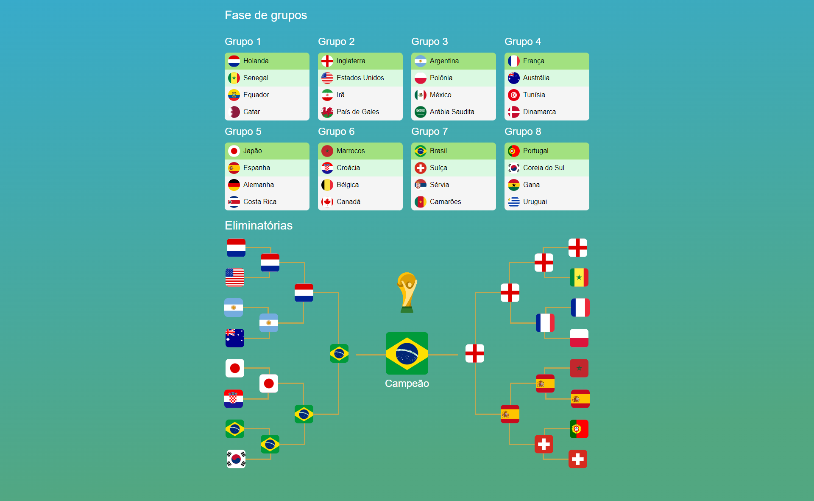

<h1 align="center">Simulador da copa do mundo 2022</h1>
<h1 align="center">
  <a href="https://angular.io/">🔗 Angular</a>
</h1>

<div align="center">
  
</div>

### 🎲 Rodando em sua máquina

Ao realizar pull do projeto e caso deseje executar o projeto localmente é necessário atender os requisitos para executar um projeto em Angular, como ter o Node.js e Angular CLI instalados.

Caso já atenda os requisitos para execução de um projeto angular, é necessário atualizar os pacotes do Node, presente no projeto executando a linha de comando abaixo:

```bash
# Clone o repositório do backend
$ git clone <https://github.com/JonathanAllisson/World-cup-simulator>

# Instale as dependências
$ npm install ou yarn

# Execute a aplicação em modo de desenvolvimento
$ ng serve -o

# O servidor inciará na porta:4200 - acesse <http://localhost:4200>

```

### 🛠 Tecnologias

As seguintes ferramentas foram usadas na construção do projeto:

- [Angular](https://angular.io/)
- [Angular Material UI](https://material.angular.io/)
